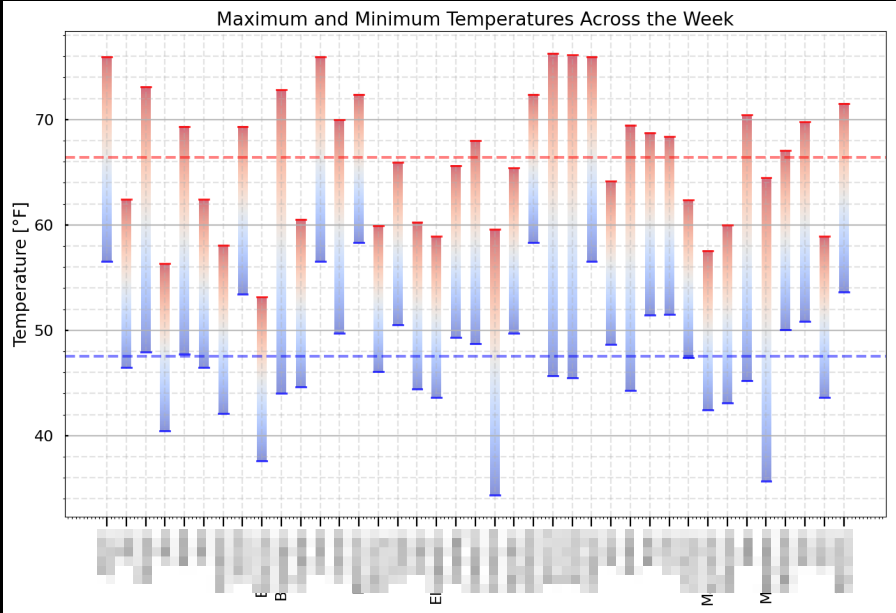

*Disclaimer: The contents of this project are created by the collaborators of this project and do not reflect any position or endorsement of the U.S. Government or the Peace Corps*

## Summary

Generate a weather report for any dispersed group.

I wrote these scripts as a fun side project during my Peace Corps service. It started as a silly idea during the summer as we all boiled in the Moroccan heat. I have been sending out this weather report every Monday since and have been having a lot of fun with it.

While I built it specifically for Peace Corps volunteers to use in their own posts, it could be used to track any group of people that are geographically dispersed.

## Warnings

None of this is endorsed by the U.S. Government or the Peace Corps.

You will have a full file that contains the names and locations of all the volunteers in your country of service, all nice and bundled up with a bow on top. Be responsible with it and *don't share it with anyone.* If you push any code improvements to GitHub, triple check that you haven't committed any volunteer data to the git history. This is to maintain volunteer safety and confidentiality in accordance with [MS 543 Section 7.5](https://files.peacecorps.gov/documents/MS-543-Policy.pdf).

## Installation and Setup

Clone this repo:

```bash
  git clone https://github.com/Westley-Winks/weather-reports.git
  cd weather-reports
```

### Prerequisites

All the packages you need are in the `requirements.txt` file. These can be installed by running `python3 -m pip install -r requirements.txt`.

For looking at the data more closely, you will need to [install Jupyter notebook](https://jupyter.org/install) separately or write your own Python scripts to query the data.

### Volunteer Locations

To get the location data for volunteers, I wrote a script that converts a `.kml` file to the proper JSON that we need. Make a *private* map on Google Maps and input everyone's location. You should then be able to export those points to a `.kml` file. Save it as `data/volunteers.kml`.

It should look like the following. You may need to add site names yourself such that each marker is titled `Volunteer Name: Site Name`. Don't forget the colon, as that is how the script separates names from site names.

```html
<Placemark>
  <name>PCV Joe: Ruralville</name>
  <styleUrl>#icon-1899-0288D1-nodesc</styleUrl>
  <Point>
    <coordinates>
      -73.98564294257926,40.748488250083234,0
    </coordinates>
  </Point>
</Placemark>
```

Then run `python3 src/parse_kml.py`. This will spit out all the volunteers' data into `data/volunteers.json`. The data is structured like this:

```json
{
  "data": [
    {
      "volunteer_name": "PCV Joe",
      "site_name": "Ruralville",
      "lat": 40.748488250083234, 
      "lon": -73.98564294257926
    },
    {
      "volunteer_name": "PCV Jane",
      ...
    }
  ]
}
```

For pandas to read it properly, you may need to format the JSON.

**Alternatively**, you can write the JSON directly. Open `data/volunteers.json` and manually write in the above for all the volunteers.

### Data Access

All weather data is provided by [Open-Meteo.com](https://open-meteo.com/). No account or API key is required for non-commercial use, according to [their license](https://open-meteo.com/en/license) and [terms of use](https://open-meteo.com/en/terms).

This project uses the Historical Weather endpoint rather than forecasts. As stated in the documentation, the data is delayed by five days.

## Usage

Once a week, run `python3 src/generate_report.py start_date end_date`. `start_date` and `end_date` should be in [ISO8601 format](https://en.wikipedia.org/wiki/ISO_8601) (e.g. 2023-03-14) and they are inclusive. Remember that the data is delayed by five days so your `end_date` should be at least five days before the current date.

The script does the following:

- Reads the volunteer locations located in `data/volunteers.json`
- Calls the [Open-Meteo Historical Weather API](https://open-meteo.com/en/docs/historical-weather-api) and gets daily weather stats for each location and each day in the date range [`start_date`, `end_date`]
- Saves the data to `data/meteo_dataframe.csv`, overwriting it each time the script is run
- Converts the metric numbers to standard
- Queries that data to find [important variables](#report-variables)
- Replaces values in `reports/REPORT_TEMPLATE.md` and spits it out into the `reports` folder
- Generates plot and puts it in the same folder

Then, open up the newly created report in a text editor, tweak it a bit to add your own quips to it, and send it out. The text is formatted according to WhatsApp's standards (names are bolded by wrapping them in single asterisks). If you want to explore the data further, I recommend opening up a [Jupyter notebook](https://jupyter.org/), read in the `data/meteo_dataframe.csv` file, filter to the dates you want, and use pandas to explore. 

Copy and paste into your group chat of choice and you're done!

## Screenshot



## Report Variables

`date_start`: Start of reporting period  
`date_end`: End of reporting period  
`max_avg_C`: Average of all daily maximums in Celsius  
`max_avg_F`: Average of all daily maximums in Fahrenheit  
`v_hottest_n`: Name of volunteer in the nth hottest site  
`v_hottest_n_Tf`: Highest temperature reached by volunteer in the nth hottest site in Fahrenheit  
`v_hottest_n_Tc`: Highest temperature reached by volunteer in the nth hottest site in Celsius  
`v_coldest_n`: Name of volunteer in the nth coldest site  
`v_coldest_n_Tf`: Lowest temperature reached by volunteer in the nth coldest site in Fahrenheit  
`v_coldest_n_Tc`: Lowest temperature reached by volunteer in the nth coldest site in Celsius  
`v_rainiest`: Name of volunteer in the site that got the most cumulative rain over the week  
`v_rainiest_mm`: Amount of cumulative rain received by volunteer in the rainiest site  

## Contributing

This is still a work in progress and prone to errors. Again, this is just a fun side project that I don't spend too much real time thinking about. This project will likely just remain as simple scripts instead of offering proper classes and methods and such because it fits my use case well enough. If you have ideas to make it better, please create an issue or reach out to me.

Again, don't commit any actual data to the git history if you do want to make improvements.

### Todo

- Add error handling so that report doesn't get thrown away if there is an error

## License

Weather Report - Generate a weather report for any dispersed group.
Copyright (C) 2023 Westley Winks [westleywinks@protonmail.com]

This program is free software: you can redistribute it and/or modify
it under the terms of the GNU General Public License as published by
the Free Software Foundation, either version 3 of the License, or
(at your option) any later version.

This program is distributed in the hope that it will be useful,
but WITHOUT ANY WARRANTY; without even the implied warranty of
MERCHANTABILITY or FITNESS FOR A PARTICULAR PURPOSE.  See the
GNU General Public License for more details.

You should have received a copy of the GNU General Public License
along with this program.  If not, see <https://www.gnu.org/licenses/>.
